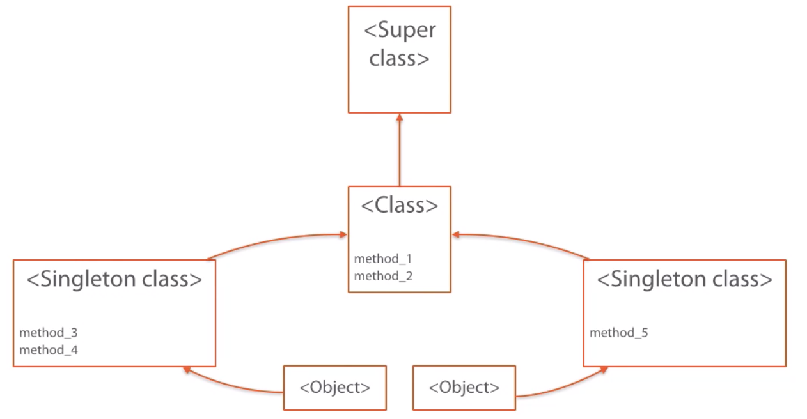

<!-- START doctoc generated TOC please keep comment here to allow auto update -->
<!-- DON'T EDIT THIS SECTION, INSTEAD RE-RUN doctoc TO UPDATE -->
**Table of Contents**  *generated with [DocToc](https://github.com/thlorenz/doctoc)*

- [Ruby Beyond the Basics](#ruby-beyond-the-basics)
  - [Object Oriented](#object-oriented)
    - [Everything is an Object](#everything-is-an-object)
    - [Special Objects](#special-objects)
    - [Classes](#classes)
    - [Methods](#methods)
    - [Duck Typing](#duck-typing)
    - [Attributes](#attributes)
    - [Reuse](#reuse)
    - [Extend](#extend)
    - [Method Dispatch](#method-dispatch)
    - [Constants](#constants)
  - [Functions](#functions)
    - [Map](#map)
    - [Blocks](#blocks)
    - [Procs vs Blocks](#procs-vs-blocks)
    - [Currying](#currying)
    - [Functional Composition](#functional-composition)
    - [Functional Thinking](#functional-thinking)
  - [Metaprogramming](#metaprogramming)
    - [Defining Dinosaurs](#defining-dinosaurs)
    - [Simple Matching](#simple-matching)
    - [Complex Matching](#complex-matching)
    - [Matching All Attributes](#matching-all-attributes)

<!-- END doctoc generated TOC please keep comment here to allow auto update -->

# Ruby Beyond the Basics

> My notes from [Pluralsight course](https://www.pluralsight.com/courses/ruby-beyond-the-basics)

## Object Oriented

Lots of languages claim to be OO but no standard definition of what this really means.

Ruby was inspired by Smalltalk.

In Ruby, objects have two things:

1. Local State (eg: two different objects each with `name` property, can change one without affecting the other)
2. Message Sending (eg: one object can send message to another such as `what's your name` to which it could respond `mary`)

Messages === Calling Methods, but always useful to think of it as one object sending a message to another.

Eg: Object with property `mary` receives message from another object like `change your name to jane`, object could respond in various ways including:

1. Changing name to `jane` (update internal state)
2. Target object can "remember" that caller wants `jane` as response so send that but for all other calls send `mary`
3. Raise exception
4. NoMethodError

Object can send messages but can't control what happens when messages are received.

Objects should not try to control behaviour of other objects.

### Everything is an Object

Well, almost.

`a`, `b`, `c` are all objects:

```ruby
irb(main):001:0> a = 10
=> 10
irb(main):002:0> b = "I'm not an object"
=> "I'm not an object"
=> irb(main):003:0> c = %i(a b c)
=> [:a, :b, :c]  # array is object, and each symbol is also an object
```

Can create custom objects by defining and instantiating classes, eg: `john` is an object:

Class `User` is also an object, as are modules, ranges, proc

```ruby
irb(main):004:0> class User; end
=> nil
irb(main):005:0> john = User.new
=> #<User:0x00007f9c3a15ebf8>
irb(main):002:0> User.class
=> Class
irb(main):003:0> module M; end
=> nil
irb(main):004:0> r = (1..10)
=> 1..10
code = Proc.new { "some proc" }
=> #<Proc:0x00007fc7df13b768@(irb):6>
```

Recall Object is something with local state and responds to messages. But since everything is an object, the local state is a collection of objects.

**Updated Object Definition**

Collection of references to other objects (aka local state) that responds to certain messages. Messages that object responds to are specified by defining methods in object's class.

Methods are objects as well. Each object has a special method named `method`, can use it to get an object of the specified method, eg: `m` is a method with a class and local state. Can send message `call` to it to invoke the method.

```ruby
irb(main):008:0> str = "String object"
=> "String object"
irb(main):009:0> m = str.method(:upcase)
=> #<Method: String#upcase>
irb(main):010:0> m.class
=> Method
irb(main):011:0> m.call
=> "STRING OBJECT"
```

Implication of everything being an object is should always write code sending messages to object.

eg - looping over array, in a not fully OO language, would have to use a control structure like a `for` loop, but in Ruby, send message `each` to array object, passing in a block of code to be executed for each value:

```ruby
irb(main):012:0> arr = [1, 2, 3, 4]
=> [1, 2, 3, 4]
irb(main):013:0> arr.each do |i|
irb(main):014:1* puts "hello" * i
irb(main):015:1> end
hello
hellohello
hellohellohello
hellohellohellohello
=> [1, 2, 3, 4]
```

If find yourself writing code that is not primarily message passing between objects, probably is not idiomatic Ruby.

### Special Objects

Some object's local state is not a reference to another object, eg: `Fixnum` object with value of 37, 37 can't be a reference to another `Fixnum` because that would cause infinite loop. Therefore value like 37 is "primitive". Same is true of `String` value.

Common objects with primitive values:
- String
- Float
- Fixnum
- Rational
- String
- Array
- True
- False
- Hash
- Symbol

These are still objects, they have a class and can call methods on them, but they're considered special kind of objects because they're internal state is not a reference to another object, but rather, a primitive value.

Also have a special constructor. Normal object creation is `object = Class.new(...)`, but for special objects, each has special syntax, eg:

```ruby
num = 42      # Fixnum
val = "hello" # String
```

Generally can treat special objects the same as other objects:

```ruby
# Assign to variable
a = [1, 2, 3]
=> [1, 2, 3]
b = " - "
=> " - "
# Call methods
a.size
=> 3
# Pass as parameters to other methods
a.join(b)
"1 - 2 - 3"
```

Can also add new methods to class (although can surprise other people trying to understand your code so be sure to document this well), eg, add a method to `String` class to determine number of vowels. Use `gsub` to remove all the characters that are not vowel, then count how many characters remain:

```ruby
irb(main):001:1* class String
irb(main):002:2*   def number_of_vowels
irb(main):003:2*     gsub(/[^aeiou]/, '').size
irb(main):004:1*   end
irb(main):005:0> end
=> :number_of_vowels
irb(main):006:0> "hello".number_of_vowels
=> 2
```

Rails uses this technique of adding methods to classes, eg: adds methods to `FixNum`, eg `minutes`:

```ruby
require 'active_support'
require 'active_support/core_ext/numeric'
4.minutes.ago
2015-06-21 14:54:37 +0100
```

### Classes

Create your own types of objects in Ruby by creating classes.

Class name must start with capital, method name must start with lower case:

```ruby
class User
  def can_vote?
    @age >= 18
  end
end
```

Special methods `initialize`, gets called by default when new instance of class is created, eg: store users age:

```ruby
require 'date'

class User
  def initialize(date_of_birth)
    # days_since_birth variable is scoped to the initialize method - cannot be accessed from other methods
    days_since_birth = Date.today - Date.parse(date_of_birth)
    # @age is instance variable - can be accessed from other methods
    @age = days_since_birth / 365
  end
  ...
end
```

Variable names starting with `@` are *instance variables* - i.e. local state for object.

Local state for object === set of object's instance variables.

Ruby is *dynamic language*, class definition is never finalized, can always re-open class by typing:

```ruby
class User
  # add new methods...
end
```

To create an object of this class, call `new` method on it. Arguments passed to `new` will be passed to class `initialize` method. Created object responds to any methods defined on class.

```ruby
john = User.new("2000-01-01")
joh.can_vote? # false
```

Classes are also objects, they have methods. Class methods can be added as part of class definition. Class methods are prefixed by `self.`

Class methods typically used to create objects, eg `new`, which exists by default on all classes.

Re-open user class to add a class method:

```ruby
class User
  self.new_voter
    date_of_birth = Date.today - (18 * 365)
    # new is class method, which is evaluated in context of this class, i.e. equivalent to calling: User.new
    new(date_of_birth.to_s)
  end
end
```

Use the new class method:

```ruby
voter = user.new_voter
voter.can_vote? # true
```

### Methods

Easy to add method (aka behaviour) to a class. Start with keyword `def`, then method name, then arguments, then method body, then keyword `end`:

```ruby
def yet_another_method(first_arg, second_art)
  "you passed in #{first_arg} and #{second_art}
end
```

**Method naming convention:** Lower case and words separated by underscore `def a_long_method_namez`, *NOT* `def ThisIsPossible`

Methods that return an attribue value usually named after the attribute, eg - give an attribute `name`, then method to access it should also be `name`:

```ruby
class User
  def initialize(name)
    @name = name
  end

  def name
    @name
  end
end
```

Methods that set an attribute are named by that attribute, followed by `=`:

```ruby
class User
  def initialize(name)
    @name = name
  end

  def name
    @name
  end

  def name=(name)
    @name = name
  end
end
```

Special Ruby syntax to use `name=` method, Ruby sees the assignment and calls `name=` method:

```ruby
obj = User.new("Bob")
obj.name = "Mary"
```

Methods that return true/false end in `?`:

```ruby
class Person
  def initialize(age)
    @age = age
  end

  def can_vote?
    @age > 18
  end
end
```

Methods that do something unexpected or destructive end in `!`:

```ruby
class Person
  def reset!
    @age = nil
  end
end
```

Good practice: Have corresponding method without `!` that does something safer.

eg: calling `select` on array returns a new array with selected results, original array is not modified, but calling `select!` does modify original array:

```ruby
a = [1,2,3,4,5]
a.select(&:even?) # [2,4]
a # [1,2,3,4,5]
a.select!(&:even?) # [2,4]
a # [2,4]
```

In Rails, `!` at end of method means it raises exception. eg: `save` and `save!` do the same thing, but if `save` fails, returns `false`, whereas if `save!` fails, raises exception.

After method name, parameter list is declared in parens, separated by comma:

```ruby
def add_numbers(first, second)
  "#{first} + #{second} = #{first + second}"
end
```

Call method with argumetns -> they get assigned to variable names in the order in which they are written

```ruby
add_numbers(5, 2) # "5 + 2 = 7"
```

Parameter list is optional, if method doesn't take any arguments, omit:

```ruby
def always_five
  5
end
always_five # 5
```

Provide default values for parameters by assigning in declaration:

```ruby
def greet(name, informal=false)
  if informal
    "hi #{name}"
  else
    "hello #{name}"
  end
end

greet("Bob") # hello Bob
greet("Alice", true) # hi Alice
```

Can have multiple optional parameters, but must be first or last param:

```ruby
# ok
def optional_first(first=1, second=2, third)
end

# ok
def optional_last(first, second=2, third=3)
end

# not ok
def no_holes_allowed(first=1, second, third=3)
end
```

Best practice: Only have one optional parameter, make it the final one, otherwise difficult to match up arg list with param list in method definition.

As of Ruby 2, can use named parameters and named defaults, then Ruby 2.1 has named required arguments.

Named default makes it clear which option is being specified.

If have last two arguments as optional, then when calling this method, forced to provide `false` as second argument to match the optional formal parameter, even though not changing its value:

```ruby
def greet(name, informal=false, shout=false)
  greeting = if informal then "hi" else "hello" end
  message = "#{greeting} #{name}"
  if shout
    message.upcase
  else
    message
  end
end

# forced to provide false for second arg
# also, hard to understand what false and true are doing, need to look at method definition
greet("John", false, true) # HELLO JOHN
```

Named parameters similar to giving a default value, but use `:` between parameter and value instead of `=`:

```ruby
def greet(name, informal: false, should: false)
  ...
end

# easier to understand, no need tomention the `informal` param because not changing its value
greent("John", should: true) # HELLO JOHN
```

Named parameter syntax looks similar to hash syntax.

Ruby 2.1 -> support named parameter without a default value:

```ruby
def greet(name:)
  "Hello #{name}"
end

# to call method, prefix argument with name of parameter - easier to understand
greent(name: "John") # Hello John

# more complex example - which list gets merged into which?
merge(list1, list2)

# easier to understand
merge(from: list1, into: list2)

# useful for methods that take lots of arguments
setup_user("john", "John", 1001, true, "/home/john", "users")
setup_user(login: "john",
  name: "John",
  uid: 1001,
  generate_password: true,
  homedir: "home/john",
  group: "users")
```

Every method in Ruby returns a value

```ruby
class MyClass
  def empty_method; end

  def one
    1
  end

  # can return from a method at any point - but NOT idiomatic ruby
  def odd_or_even(num)
    if num.odd?
      return "odd"
    else
      return "even"
    end
  end

  # better: `if` expression returns value of last branch evaluated
  def odd_or_even(num)
    if num.odd?
      "odd"
    else
      "even"
    end
  end

  # return keyword useful if want to return early and can't continue
  # if called with string, returns nil: MyClass.odd_or_even("fish) # nil
  def odd_or_even(num)
    return unless num.respond_to?(:odd?)

    if num.odd? then "odd" else "even" end
  end
end

# empty method returns nil
MyClass.new.empty_method # nil

# no explicit return needed, by default last value in method is returned
MyClass.new.one # 1

MyClass.new.odd_or_even(3) # "odd"
```

### Duck Typing

Can't statically analyze code, eg: determine if class will respond to a method because classes can be opened for modification to add or remove methods.

```ruby
class E
end

E.ping # undefined method `ping' for E:Class

# does E have ping method now? It depends on what user types and if statement evaluates to true
class E
  if gets("Type ping to add method > ").match("ping")
    def self.ping
      "pong"
    end
  end
end
```

Rails Active Record - method on model depend on underlying database schema, can't know what those mthods will be just be looking at source code.

Even if looking at a class for methods, no guarantee it isn't re-opened elsewhere, or if files get included in a different order, a method may be defined too late or too soon.

**Duck Typing** If it walks like a duck adn quacks like a duck, it probably is a duck.

Instead of checking an object's class, ask about its behaviour - i.e. messages it responds to, eg:

```ruby
def print_info(obh)
  if obj.class == User
    obj.name
  else
    obj.to_s
  end
end
```

Problem is even if passed an object having class `User`, no guarantee it responds to message `name`. Replace class check with check of objects behaviour. `respond_to?` returns true if object has the supplied method, and false otherwise:

```ruby
def print_info(obj)
  if obj.respond_to?(:name)
    obj.name
  else
    obj.to_s
  end
end
```

Can call `print_info` with an object that isn't a `User` but does have a `name` method. Code doesn't care what object is, it only cares how object behaves.

Good Ruby code is not concerned with classes, should focus on messages passing between objects. Should be easy to change type of object being used, as long as it responds to same messagest.

Creating classes -> trivial implementation details. Good OO design -> think about messages flowing between objects.

### Attributes

Usually when a method is created, its part of a class.

For instance variable, to create it, just use it. No need to declare it in advance.

Instance variables are treated like normal variables but their name must start with single `@`.

```ruby
# normal variable
name = "John"
puts name # John
# instance variable
@name = "John"
puts @name # John
```

Every instance variable is guaranteed to return a value. If a value hasn't been explicitly assigned in code, then it returns `nil`. Can be a source of bugs:

```ruby
class BuggyUser
  def initialize(name)
    @name = name
  end

  def say_my_name
    puts "My name is #{@naem}" # intentional typo here!
  end
end

me = BuggyUser.new("John")
# This runs, but `@naem` is nil so prints nothing
me.say_my_name # My name is
```

When an instance variable is used, sending message "give me the value for this name", if there is a value, it gets returned, otherwise `nil` returned.

To return value of instance variable, add reader method, that returns a reference to the object that the instance variable points to.

To allow external objects to write the value of instance variable, add writer method. Method name has `=` at end, takes single argument that becomes value of instance varaibel.

```ruby
class User
  # reader
  def name
    @name
  end

  # writer
  def name=(name)
    @name = name
  end
end

# Usage of writer - looks like normal assignment, Ruby converts this to a method call `name=`
user = User.new
user.name = "Betty"
```

To avoid tedius reader/writer methods, use special keyword `attr_reader` and/or `attr_writer` followed by symbol with name of instance variable. Can define multiple instance variables in one line using comma separated list of symbols.

```ruby
class User
  attr_reader :name, :age
  attr_writer :name
end
```

Use keyword `attr_accessor` to create both a reader and writer in one line:

```ruby
class User
  attr_accessor :name
end

User.public_instance_methods(false).grep(/name/) # [:name, :name=]
```

CAUTION: If a class has many accessors, rethink design. Program should be about flow of messages, not allowing objects to manipulate intenral state of other objects.

### Reuse

**Inheritance**

Single inheritance - every class has one super class, specified by `<`:

```ruby
class User
  attr_reader :name

  def initialize(name)
    @name = name
  end
end

class AdminUser < User
  def is_admin?
    true
  end
end


```

Class inherits all methods from its superclass, unless overrides or removes

If no superclass explicitly defined with `<`, `Object` is assumed:

```ruby
AdminUser.superclass    # User
User.superclass         # Object
Object.superclass       # BasicObject
BasicObject.superclass  # nil
```

Classes can be re-opened, eg: re-open `Object` class to add a method, then this method becomes available to all other objects:

```ruby
class EmptyClass; end

obj = EmptyClass.new
obj.ping # NoMethodError: undefined method `ping`

# re-open Object class
class Object
  def ping
    "pong"
  end
end

# now `ping` method is available on anything that inherits from `Object`
obj.ping # "pong"
new_obj = EmptyClassnew
new_obj.ping # "pong"

"Hello".ping # "pong"
7.ping # "pong"
[1, 2, 3].ping # "pong"
```

Use `method` class to learn where a method came from:

```ruby
obj = EmptyClass.new
m = obj.method(:ping) # <Method: EmptyClass(Object)#ping>
m.receiver # <EmptyClass:0x007fe5a94336e0>
m.owner # Object
```

**Modules**

Module is a collection of methods. More flexible way to share behaviour.

Use `module` keyword, much like class, can define methods and attributes:

```Ruby
require 'date'
module Employee
  attr_accessor :start_date

  def employment_length
    days = Date.today - start_date.to_date
    "#{days_to_i} days"
  end
end
```

Add module to class using keyword `includee`, followed by module name. Now all module methods are available in the class

```ruby
class User
  include Employee
end

u = User.new
u.start_date = Date.today - 365
u.employment_length # "365 days"
```

Superclass of `Class` is `Module`. i.e. Class is a special type of Module that can be instantiated by calling `new`.

Class can only have one superclass, but can include multiple modules.

### Extend

Another way to use modules.

Recall `include` adds module methods to class.

`extend` adds module methods to a *single instance* of the class.

```ruby
require 'date'

module Employee
  attr_accessor :start_date
end

class User
end

user = User.mew
# pass in name of module to `extend` method
user.extend(Employee)

# user object how has module methods
user.start_date = Date.today

# where did module methods go?
User.public_instance_methods.grep(/start_date/) # []  not here

# if create another object, will not have Employee module methods
another_user = User.new
another-user.methods.grep(/start_date/) # []

# check original user object - where are these methods?
user.methods.grep(/start_date/) # [:start_date, :start_date=]
```

Ruby adds special class to each object to hold methods that got added to just that object via `extend`, but not added to that object's class.

Every object, in addition to having a `Class`, also has its own class `Singleton class`, that allows an individual object to be extended, without affecting other instances from same class.



```ruby
user.singleton_class.public_instance_methods.grep(/start_date/) # [:start_date, :start_date=]
```

When `extend` object with a module, the module methods get included in the objects singleton class.

### Method Dispatch

When a method is called, how does Ruby determine where that method is defined? Looks in following sequence, stops when found:

1. Object's Singleton class
2. Object's Class (which is superclass of object's singleton class)
3. Object's classes superclass
4. ... up inheritance chain
5. BasicObject (recall superclass is nil)

If gets as far as BasicObject and still method not found, then goes back down to object's Singleton class and looks for method named `method_missing`, if it exists in Singleton class, will get called.

If `method_missing` not found on Singleton class, goes up the hierarchy chain again in the same sequence, looking for `method_missing`.

If gets to BasicObject and still no `method_missing` -> NoMethodError.

**method_missing**

Takes 3 arguments:

1. Name of method that was called (passed in as a symbol)
2. List of parameters from original method call (via splat)
3. Optional block (discussed in next module)

```ruby
method_missing(name, *args, &block)
```

Note that args are passed via splat - i.e. take any leftover arguments from this point and turn them into array:

```ruby
some_method(a, b, c)
# turns into:
some_method([a, b, c])
```

Example - respond to any method that starts with `p`:

```ruby
class AnyP
  def method_missing(name, *args)
    # method name is symbol, convert to string for comparisons
    if name.to_s.start_with?('p')
      "You called #{name} with #{args.inspect}"
    else
      # tell ruby to keep looking up the inheritance chain for this method
      super
    end
  end
end

# Usage
has_p = AnyP.new
has_p.cactus # NoMethodError
has_p.pterodactyl # "You called pterodactyl with []"
has_p.people(true, 17, :whatever) # "You called people with [true, 17, :whatever]"
```

### Constants

Look like variables, but by convention use capital letters, eg:

```ruby
PI = 3.14
# also valid
Pi = 3.14
# ruby lets you re-assign, with warning
PI = 3.142 # warning: already initialized constant PI
PI # 3.142
```

Constants scoped to surrounding module:

```ruby
module Geometry
  PI = 3.14
end

module Circle
  PI = 3.14
end

# We have two different constants
Geometry::PI == Circle::PI # false
```

Recall class names also start with capital - i.e. classes are also constants. By default, classes created as constants under the `Object` class.

Some methods for looking at constants:

```ruby

Object.constants # [:SystemExit, :IO, :SignalException, :Interrupt,...]

class ExampleClass; end

# newly created class is now a constant under Object class
Object.constants.grep(/ExampleClass/) # [:ExampleClass]

# can use this constant to instantiate an object of ExampleClass
# because the constant IS the ExampleClass
Object::ExampleClass.new

# Can also remove constants but `remove_const` method is private
Object.remove_const(:ExampleClass) # NoMethodError: private method `remove_const' called for Object:Class

# Workaround private method using special method `send`
Object.send(:remove_const, :ExampleClass)

# This no longer works now that ExampleClass constant has been removed
Object::ExampleClass.new # NameError: uninitialized constant ExampleClass
```

This technique is in part how dynamic loading works in Rails - keeps track of what classes are loaded, then can use `remove_const` to throw them away and reload.

Can also use `const_set` to define new classes:

```ruby
# Classes are objects too so they can be instantiated by sending `new` method
# pass in block to `new` method to define methods in the newly created class
Object.const_set(:NewClass, Class.new do
  def ping
    "pong"
  end
end)

# Can use NewClass just like any other normal class
NewClass.new.ping # "pong"
```

## Functions

Ruby is selective about what funcional programming principles it brings in.

First some explanation of what functional programming is and how it differs from OO.

Using mathematical functions to perform calculations.

Math definition of function: A relation between a set of input values and a set of output values.

**Functional Programming Concepts**

1. Functions are definitions, not lists of instructions.
2. Immutable definitions, not variables.
3. Functions are first class citizens (can use function anywhere a normal variable would be used, including passing to other functinos).

### Map

Given a list of prices, apply a discount to each entry:

```ruby
prices = [100, 75, 90, 80, 50]

# Procedural approach
def apply_discount(prices)
  discounted_prices = []
  prices.each do |price|
    reduced_price = price - (price * 0.15)
    discounted_prices << reduced_price
  end
  discounted_prices
end

# Usage
apply_discount(prices) # [85.0, 63.75, 76.5, 68.0, 42.5]
```

How about adding tax?

```ruby
# Procedural approach
def add_tax(prices)
  prices_with_tax = []
  prices.each do |price|
    prices_with_tax << price + (price * 0.2)
  end
  prices_with_tax
end

# Usage
add_tax(prices) # [120.0, 90.0, 108.0, 96.0, 60.0]
```

Both functions are similar - iterating over list, applying some formula, returning results.

Only difference is what's applied to each price.

`map` function knows how to get from each value in original array to new value in new array.

```ruby
def map(list, fn)
  results = []
  list.each do |item|
    # apply the function???
  end
end
```

How to pass one function to another in Ruby?

`Proc` object new instantiated followed by keyword `do`, with code that should be executed when proc is applied.

Parameters to proc are provided between pipe symbols `|`

```ruby
# A Proc object
discount = Proc.new do |price|
  price - (price * 0.15)
end

# Example usage
discount.call(100) # 85.0
```

Code between `do` and `end` does NOT get executed immediately. Will run when proc is called.

```ruby
bad_code = Proc.new do
  raise "oh noes! an exception!"
end
# no error yet because proc has not been called

# call it now
bad_code.call # RuntimeError: oh noes! an exception!
```

Back to our home grown map function, using proc:

```ruby
def map(list, fn)
  results = []
  list.each do |item|
    results << fn.call(item)
  end
end

# Usage
map(prices, discount) # [85.0, 63.75, 76.5, 68.0, 42.5]

# Now can apply tax without code duplication
tax = Proc.new do |price|
  price + (price * 0.2)
end
map(prices, tax) # [120.0, 90.0, 108.0, 96.0, 60.0]
```

`map` is already built into Ruby, method available on anything that includes `Enumerable` such as arrays:

```ruby
# call `map` method on `prices` array, passing in `tax` proc object
# must prefix proc object with `&` -> tell Ruby the argument contains some code to be run
prices.map(&tax) # [120.0, 90.0, 108.0, 96.0, 60.0]
```

### Blocks

In previous section, had to create a `Proc` object, assign to variable, and pass this variable into map function. Very tedious all this typing, and often, the proc object isn't used anywhere else.

Would be more useful to create an *anonymous proc* to be used just once, then throw away. Ruby supports this - pass blocks to methods using `do...end` syntax:

```ruby
prices = [100, 75, 90, 80, 50]
prices.map do |price|
  price + (price * 0.2)
end # [120.0, 90.0, 108.0, 96.0, 60.0]
```

Block of code between `do` and `end` is called for each item in the list.

`map` returns a new list, consisting of the block of code applied to each item in original list in sequence.

**How to write method that accepts a block of code?**

Block of code may be optional, need to determine if it was given.  Use built-in `block_given?` method:

```ruby
def called_with_block?
  if block_given?
    puts "you called me with a block"
  end
end

# Usage
called_with_block? # nil
called_with_block? do
  1 + 2
end # "you called me with a block"
```

If a block has been passed in, use built-in `yield` method to stop current method execution, and run the given block of code. When block finishes execution, current method resumes execution after `yield`:

```ruby
def print_and_yield
  puts "before calling yield"
  yield
  puts "after calling yield"
end

# Usage with a block
print_and_yield do
  puts "I am the block"
end
# before calling yield
# I am the block
# after calling yield
```

Typically will want to pass arguments into the given block and get output back, eg: simple implementation of built-in `each` method:

```ruby
def each_in_list(list)
  for i in 0..(list.length - 1)
    yield list[i]
  end
end

# Usage
each_in_list([1, 2, 3, 4, 5]) do |x|
  puts x * 2
end
# 2
# 4
# 6
# 8
# 10
```

Use return value from block:

```ruby
def map_words(input)
  results = []
  input.split.each do |word|
    results << yield(word)
  end
  results
end

# Usage
map_words("My name is John") do |word|
  word.size
end
# [2, 4, 2, 4]
```

### Procs vs Blocks

Multiple syntax options for creating and calling procs.

Some overlap between procs and blocks but they're not the same -> used for different purposes.

**Blocks**

Blocks of code can be passed into methods by following the method name with keyword `do`, followed by parameter list in pipes, followed by code to be run, followed by keyword `end`.

eg - pass block of code into enumerable `select` method to pick out prices less than 50:

```ruby
prices = [10, 100, 40, 75, 30]
prices.select do |price|
  price < 50
end # [10, 40, 30]
```

Can also specify block of code using curly braces, eg - same code as above replacing `do` with `{` and `end` with `}`:

```ruby
prices.select { |price| price < 50 }
```

Use braces when block fits on one line and `do/end` when code spans multiple lines.

**Procs**

One way to create Proc is by calling `new` on `Proc` class and pass in block of code, can use do/end or curly braces:

```ruby
cheap = Proc.new do |price|
  price < 50
end

# equivalent
cheap = Proc.new { |price| price < 50 }
```

Few different ways to call a proc:

```ruby
# Send `call` message to proc object with arguments in parens
cheap.call(100) # false

# Follow name of proc object by list of arguments wrapped in square brackets:
cheap[100] # false

# Can also send a pair of parens
cheap.(100) # false
```

Recommanded: Use expicit `call` message because its the most clear.

**Lambda**

Similar to proc, create using special keyword `lambda` followed by block in curly braces. Object returned in a special type of proc object:

```ruby
cheap = lambda { |price| price < 30 } #<Proc:0x007f... (lambda)>

# lambda can be called same as any other proc
cheap.call(50) # false

# another way to declare a lambda: parameter list moves out of block and immediately follows arrow
cheap = -> price { price < 30 }

# call it using square bracket syntax
cheap[10] # true

# can also wrap parameter list in parens:
cheap = -> (price) { price < 30 }
cheap[10] # true

# lambdas can take multiple arguments
cheapest = -> price1, price2 { [price1, price2].min }
cheapest[50, 30] # 30
```

Lambdas created with arrow syntax called *stabby lambdas*

Lambdas and procs behave differently when checking their arguments. eg - create a proc and lambda that take a single argument then print it out. What happens when these are called without their arguments?

```ruby
p = Proc.new { |x| "you called me with #{x.inspect}" }
l = -> x { |x| "you called me with #{x.inspect}" }

# x gets assigned to nil for proc called without its argument
p.call # "you called me with nil"

# lambda called without its expected argument raises error
l.call # ArgumentError: wrong number of arguments (0 for 1)
```

Prefer lambdas over procs when want validation that correct number of arguments were passed in when called.

**More on blocks**

When writing a method that takes a block, use special syntax to assign the block to a parameter. Use an optional final parameter, prefixed by `&`:

```ruby
def modify_prices(prices, &block)
  block.inspect
end

prices = [10, 100, 50]
# block passed into method is actually a proc
modify_prices(prices) { |p| p * 1.2 } #Proc:0x007f...

# HOWEVER, can't pass in a proc directly (eg: stabby lambda)
add_tax = -> p { p * 1.2 }
modify_prices(prices, add_tax) # ArgumentError: wrong number of arguments (2 for 1)

# This will work - prefix block with ampersand - not commonly used like this (see next section for common usage)
modify_prices(prices, &add_tax) #<Proc:0x007f... (lambda)>
```

The `&` trick is useful together with the `to_proc` method on `Symbol` class.

Proc that's returned from `to_proc` method takes a single parameter, then tries to call a method matching the original symbol on that parameter.

```ruby
# can send `to_proc` message to any symbol
:even?.to_proc #<Proc:0x007f...>

# send message `even` to `4`:
:even?.to_proc.call(4) # true
:even?.to_proc.call(5) # false

# this won't work because strings don't respond to `even` message
:even?to_proc.call("hello") # NoMethodError: undefined method `even?` for "hello":String
```

Shorthand way of creating a proc that says call this message on the value - eg: given a list of prices, find all that are even:

```ruby
prices = [75, 50, 12]

# verbose solution
prices.select { |p| p.even? } # [50, 12]

# more consice, call select passing in symbol even
prices.select(&:even?) # [50, 12]
```

In this example `prices.select(&:even?)` ampersand:

1. Calls `to_proc` on symbol `:even?`
2. Tells Ruby this proc will act like a block being passed to method `select`

This is a concise way of calling a single method on a list of objects.

Another eg - convert list of prices to floats:

```ruby
prices.map(&:to_f) # [75.0, 50.0, 12.0]
```

In practice, blocks used a lot, lambdas occasionally.

Use block when calling a method, and expecting the block code to be run as part of that method.

Use lambdas when want to store a block of code and use it later. Often used when need to delay execution until later.

Use `&` (aka `to_proc`) together with symbl when want to call a single method on a list of objects.

### Currying

aka *Partial application* - call a proc with some arguments now, then call it with rest of the arguments later.

Example:

```ruby
# proc that multiplies two numbers together
mult = -> x, y { x * y }

# call proc
mult[2, 3] # 6

# send message `curry` with first of the two numbers
# use square brackets when calling curry to let Ruby know arguments are for original proc, rather than arguments to curry
double = mult.curry[2] # returns new Proc object

# call new proc with second argument
# will always use original argument that was given (2) and passes it in as first argument to original proc
double[2] # 4
double[4] # 8
```

Practical example - e-commerce platform, want to run some promotions:

```ruby
class Promotion
  # `calculator` is a proc
  def initialize(description, calculator)
    @description = description
    @calculator = calculator
  end

  def apply(total)
    total - @calculator[total]
  end
end

# Usage
discount = Promotion.new(
  "15% off everything",
  -> total { total * 0.15 }
)

# We want many different kinds of promotions, eg:
ten_pc = Promotion.new(
  "10% if you spend over $50",
  -> total { total > 50 ? total * 0.1 : 0 }
)

ten_pc.apply(45) # 45
ten_pc.apply(100) # 90

# Another promotion
fifteen_pc = Promotion.new(
  "15% if you spend over $100",
  -> total { total > 100 ? total * 0.15 : 0}
)

fifteen_pc.apply(50) # 50
fifteen_pc.apply(150) # 127.50
```

Notice that the two different `calculators` (as stabby lambdas in above code sample) are very similar:

```ruby
-> total { total > 50 ? total * 0.1 : 0 }
-> total { total > 100 ? total * 0.15 : 0}
```

Remove dupe code by creating more general calculator, then curry it with desired values:

```ruby
# a general calculator
calc = -> threshold, discount, total do
  total > threshold ? total * discount : 0
end

# create more specific calculators with partial application
ten_pc_calc = calc.curry[50, 0.1]
fifteen_oc_calc = calc.curry[100, 0.15]

# use the curried calculators
ten_pc_calc[45] # 0
ten_pc_calc[100] # 10.0
fifteen_pc_calc[150] # 22.5

# use the curried procs when creating promotions
# Promotion class doesn't care if `calculator` is a curried Proc or regular proc
ten_pc = Promotion.new(
  "10% if you spend over $50",
  ten_pc_calc
)
ten_pc.apply(100) # 90

fifteen_pc = Promotion.new(
  "15% if you spend over $100",
  fifteen_pc_calc
)
fifteen_pc.apply(150) # 127.5
```

**Advantages of currying**

1. Remove code duplication.
2. Write general functions, then create more specialized functions from these for business domain.

### Functional Composition

aka joining functions together

eg: e-commerce company wants reports on how well products are selling, suppose you have products pulled from db, each having some attributes.

Will use `inject` method from `Enumerable` - takes a single parameter representing the initial value, and a block with two parameters - first param is result of last time block was run (or initial value when it first runs) - used to keep running total. Second parameter gets set to each item in the enumerable collection. Block is run once for each product.

```ruby
products.sample # <struct Product price-10, rating=1, color=:green, sales=2251>

# Report #1: Calculate average sale price for all products
class Report
  def initialize(products)
    @products = products
  end

  def run
    # calculate total value of all sales
    money_taken = @products.inject(0) do |total, product|
      (product.price * product.sales) + total
    end

    # calculate number of products sold
    total_sales = @products.inject(0) do |total, product|
      product.sales + total
    end

    # calculate average selling price
    money_taken / total_sales
  end
end

# Usage
Report.new(products).run # 42
```

New requirements - sales promotion on red products - new report to show average price of red things sold, and total money taken on all red products.

Modify report class for new requirement by adding parameter to `run` method:

```ruby
class Report
  def initialize(products)
    @products = products
  end

  def run(red_only: false)
    # Determine what selection of products the report will run for
    selection = @products
    if red_only
      selection = selection.select { |product| product.color == :red }
    end

    # calculate total value of all sales
    money_taken = @products.inject(0) do |total, product|
      (product.price * product.sales) + total
    end

    # calculate number of products sold
    total_sales = @products.inject(0) do |total, product|
      product.sales + total
    end

    # return average selling price and money taken
    {
      average_sales_price: money_taken / total_sales,
      money_taken: money_taken
    }
  end
end

# Usage
Reports.new(products).run # {:average_sales_price=>42, :money_taken=>5172310}
Reports.new(products).run(red_only: true) # {:average_sales_price=>39, :money_taken=>1700340}
```

New requirement: Report on top 3 selling products - add new method `top_selling` to `Report` class:

```ruby
class Report
  def initialize(products)
    @products = products
  end

  def run(red_only: false)
    ...
  end

  def top_selling
    @products.sort_by(&:sales).last(3)
  end
end
```

New requirement: Report on top 3 selling *red* products:

```ruby
class Report
  def initialize(products)
    @products = products
  end

  def run(red_only: false)
    selection = select_products(red_only)
    ...
  end

  def top_selling(red_only: false)
    selection = select_products(red_only)
    selection.sort_by(&:sales).last(3)
  end

  def select_products(red_only)
    selection = @products
    if red_only
      selection = selection.select { |product| product.color == :red }
    end

    selection
  end
end
```

Report class is getting too long and harder to maintain as new report requirements come in - too many conditional flags and logic.

Use functional approach to make improvements - eg: lambda for average sale price, break it down into smaller functions:

```ruby
require "./products"

# use to_proc trick with add symbol
sum = -> list { list.inject(&:a) }

sales_value = -> products do
  product_revenue = products.map { |product| product.sales * product.price }
  sum[product_revenue]
end

total_sales = -> products { sum[products.map(&:sales)] }

avg_sale_price = -> products { sales_value[products] / total_sales[products] }

# Usage
avg_sale_price[PRODUCTS] # => 44

# Red only
red = -> products { products.select { |p| p.color == :red} }

# Make output of `red` lambda get used as input for `avg_sale_price` lambda
class FunctionalReport
  # fns is list of functions that will generate each stage of the report
  def initialize(products, *fns)
    @products = products
    @fns = fns
  end

  # run all the functions in sequence
  def run
    @fns.inject(@products) do |last_result, fn|
    fn[last_result]
  end
end

# Usage
FunctionalReport.new(PRODUCTS, avg_sale_price).run # 44
FunctionalReport.new(PRODUCTS, red, avg_sale_price).run # 48

green = -> products { products.select { |p| p.color == :green } }
high_rating = -> products { products.select { |p| p.rating >= 3 } }

FunctionalReport.new(PRODUCTS, green, high_rating, total_sales).run # 16089
```

There is some code duplication between lambdas to find red or green products:

```ruby
red = -> products { products.select { |p| p.color == :red} }
green = -> products { products.select { |p| p.color == :green } }
```

To remove dupe code, write generic function to filter products by some attribute, then use curry to create specific queries:

```ruby
# attr      Attribute to filter by
# op        Operation to be applied
# value     Value to compare each product to
# products  List of products (IMPORANT: This must be last argument to support currying later)
by_attribute = -> attr, op, value, products do
  # Use select as always, get attribute of interest for each product,
  # Call operation on the product by sending it as a message to that attribute,
  # passing in given value.
  products.select { |p| p[attr].send(op, value) }
end

# Create a specialized function to search by color,
# by partially applying above lambda
by_color = by_attribute.curry[:color, :==]

# Specialize by looking for blue products
blue = by_color.curry[:blue]

# Sample usage
blue[PRODUCTS].take(3)
# [<struct Product price=10, rating=3, color=:blue, sales=1122>, ... ]

# Maximum rating
by_max_rating = by_attribute.curry[:rating, :<]
low_rating = by_max_rating.curry[3]

# Combine into final report: Top 3 lowest rated blue products
FunctionalReport.new(PRODUCTS, blue, low_rating).run.take(3)
```

Above is very clever but should Ruby code be written like this?

### Functional Thinking

Code in previous section is not really idiomatic Ruby, especially currying and composing lambdas. For that recommend functional language.

Recommended functional techniques include:
- map, select, inject, etc
- blocks for processing lists of data
- lambdas when need to run some code later

**Revisit Composition**

Replace lambdas with regular objects:

```Ruby
require './products'

# red = -> products { products.select { |p| p.color == :red }}

class RedFilter
  def apply(products)
    products.select { |p| p.color == :red }
  end
end

# Usage
RedFilter.new.apply(PRODUCTS).take(3)
```

Even more flexible - filter by any color:

```ruby
class ColorFilter
  attr_reader :color

  def initialize(color)
    @color = color
  end

  def apply(products)
    products.select { |p| p.color == @color }
  end

  def to_s
    "Filtering for #{self.color} products"
  end
end

# Usage
filter = ColorFilter.new(:blue)
filter.apply(PRODUCTS).take(3)
```

## Metaprogramming

In the code below, `has_many` and `belongs_to` are method calls that will generate new Ruby code. Specifically, they add extra methods to the active record model to access other associated collections and classes, i.e. they're not regular methods, they *change the definition of the class*.

`has_many` and `belongs_to` are class methods - get evaluated when class is defined, not when its instantiated or later by sending a message.

```ruby
class Post < AciveRecord::Base
  has_many :comments
  belongs_to :user
end
```

Meta programming often involves adding/modifying functionality on a class - does so at *run time*. This feature allows a framework like Rails to be written with Ruby.

To demonstrate meta programming - will build online dating platform for dinosaurs.

### Defining Dinosaurs

Match dinosaurs with similar interests. Start with [dinosaur data](dinosaurs/data.rb) - one json object per species:

```ruby
# dinosaurs/data.rb
TREX_DATA = {
  name: 'Tyrannosaurus Rex',
  order: 'Saurischia',
  suborder: 'Theropoda',
  family: 'Tyrannosauridae',
  diet: "carnivore",
  period: "Late Cretaceous",
  length: 4500,
  weight: 6400,
  first_discovered: 1874,
  hobbies: [
    "Scaring children",
    "Battling triceritops",
    "Bowling"
  ]
}

PTERODACTYL_DATA = {
  name: 'Ptyerodactyl',
  order: 'Pterosauria',
  suborder: 'Pterodactyloidea',
  family: 'Pterodactylidae',
  diet: "carnivore",
  period: "Late Jurassic",
  wingspan: 1040,
  first_discovered: 1784
}
...
```

Naive way would be to create a class for each species, eg:

```ruby
class TyrannosaurusRex
  attr_reader :period, :size, :weight, :hobbies

  def initialize(data)
    @period = data[:period]
    @size = data[:size]
    @weight = data[:weight]
    @hobbies = data[:hobbies]
  end
end

trex = TyrannosaurusRex.new(TREX_DATA)
```

Doesn't scale for large number of species, 300+

Could have general Dinosaur superclass, then specific subclasses, but also doesn't work because care about different data for different species. Eg - only some species have `wingspan`. Also properties in json will keep changing as platform developers.

Desired solution: Dynanically create attribute methods depending on the data available for each dinosaur.

Methods can be defined at run time using `define_method` method, simple eg - note it must be class method, the new method will ba added for all instances of the class.

```ruby
class Dinosaur
  def self.add_method(method_name)
    # pass in method_name, and a block to define the new methods behaviour
    define_method(method_name) do
      "this method was dynamically defined"
    end
  end
end

# Usage
d = Dinosuar.new
Dinosaur.add_method(:roar) # "this method was dynamically defined"
```

`define_method` is private, can't call it outside a class method.

What we really want is to add an `attr_reader` dynamically, use `define_method` for this, wrapped in a new class method `add_attribute`:

```ruby
require "./data"

class Dinosaur
  # name: name of attribute
  # value: value to be returned when attribute is read
  def self.add_attribute(name, value)
    define_method(name) do
      value
    end
  end

  # read in each json attribute, creating an attribute for it
  def initialize(data)
    data.each do |key,value|
      self.class.add_attribute(key, value)
    end
  end
end

# Usage
d = Dinosaur.new(TREX_DATA)
d.name # "Tyrannosaurus Tex"
d.length # 4500
d.hobbies # ["Scaring children", "Battling triceritops", "Bowling"]
```

### Simple Matching

Will match dinosaurs based on a collection of attributes such as common hobbies, suborder, height.

Keep it flexible by chaining together primitive matches.

Naive approach is to declare a match method for every attribute we're interested in:

```ruby
class Diplodocus < Dinosaur
  def match_diet(diet)
    self.diet == diet
  end

  def match_suborder(suborder)
    self.suborder == suborder
  end
end
```

`match_diet` and `match_suborder` above are nearly identical, only difference is attribute being compared.

Desired - tell Ruby the attribute, and have it generate the repetitive part of the code.

Recall that classes are also objects -> they can have methods and attributes of their own.

First attempt - `match_on` will try to call a method on the class

```ruby
class Diplodocus < Dinosaur
  match_on :diet
  match_on :suborder
end
```

`match_on` method is common to all Dinosaurs, it's a class method -> start with `self.`

```ruby
require "./data"

class Dinosaur
  def self.add_attribute(name, value)
    define_method(name) do
      value
    end
  end

  def self.match_on(attr_name)
    method_name = "match_#{attr_name}"
    define_method(method_name) do |value|
      # retrieve an attribute, and compare to value passed in
      # i.e. "call this method whose name matches a value stored in this variable"
      # eg: if attr_name is diet, invoke the `diet` method,
      # which got defined dynamically by self.add_attribute above
      attr = self.send(attr_name)
      attr == value
    end
  end

  def initialize(data)
    data.each do |key,value|
      self.class.add_attribute(key, value)
    end
  end
end

# Usage
d = Diplodocus.new(DIPLODOCUS_DATA)
d.match_diet("herbivore") # true
d.match_suborder("Theropoda") # false
```

Using class methods to generate code, now can easily add another dinosaur subclass to match on `suborder`. Notice the only code seen is what we want to achieve, not steps how to do it:

```ruby
class TyrannosaurusTex < Dinosaur
  match_on :suborder
end

# Usage
trex = TyrannosaurusTex.new(TREX_DATA)
trex.match_suborder("Theropoda") # true
```

This is start of DSL (domain specific languages).

### Complex Matching

eg - want to match on "at least one hobby in common", simple `match_on` from previous section only does equality.

```ruby
class TyrannosaurusTex < Dinosaur
  match_on :suborder
  match_on :hobbies # not quite...
end

# Usage (not yet working)
trex = TyrannosaurusTex.new(TREX_DATA)
trex.match_hobbies(["Scaring children"]) # false
```

Modify matcher method to take optional block, and use it to perform matching. If no block given, then default to equivalence check:

```ruby
require './data'

class Dinosaur
  def self.add_attribute(name, value)
    define_method(name) do
      value
    end
  end

  def self.match_on(attr_name, &block)
    method_name = "match_#{attr_name}"
    matcher = block || -> attr, value { attr == value }
    define_method(method_name) do |value|
      attr = send(attr_name)
      matcher.call(attr, value)
    end
  end

  def initialize(data)
    data.each do |key, value|
      self.class.add_attribute(key, value)
    end
  end
end

class TyrannosaurusTex < Dinosaur
  match_on :suborder
  match_on :hobbies do |our_hobbies, other_hobbies|
    (our_hobbies & other_hobbies).any?
  end
end

# Usage
trex = TyrannosaurusTex.new(TREX_DATA)
trex.match_hobbies(["Scaring children"]) # true
```

Further improvement - comparing two arrays if they have anything in common is useful - move it up to `Dinosaur` superclass:

```ruby
require './data'

class Dinosaur
  def self.add_attribute(name, value)
    define_method(name) do
      value
    end
  end

  def self.match_on(attr_name, &block)
    method_name = "match_#{attr_name}"
    matcher = block || -> attr, value { attr == value }
    define_method(method_name) do |value|
      attr = send(attr_name)
      matcher.call(attr, value)
    end
  end

  def self.match_on_any(attr_name)
    self.match_on(attr_name) do |ours, theirs|
      (ours & theirs).any?
    end
  end

  def initialize(data)
    data.each do |key, value|
      self.class.add_attribute(key, value)
    end
  end
end

# Now trex class can use `match_on_any` for hobbies
class TyrannosaurusTex < Dinosaur
  match_on :suborder
  match_on_any :hobbies
end

# Usage
trex = TyrannosaurusTex.new(TREX_DATA)
trex.match_hobbies(["Scaring children"]) # true
```

Now that matcher accepts a block, can further enhance DSL with `match_on_at_least`:

```ruby
require './data'

class Dinosaur
  def self.add_attribute(name, value)
    define_method(name) do
      value
    end
  end

  def self.match_on(attr_name, &block)
    method_name = "match_#{attr_name}"
    matcher = block || -> attr, value { attr == value }
    define_method(method_name) do |value|
      attr = send(attr_name)
      matcher.call(attr, value)
    end
  end

  def self.match_on_any(attr_name)
    self.match_on(attr_name) do |ours, theirs|
      (ours & theirs).any?
    end
  end

  def self.match_on_at_least(attr_name, threshold)
    self.match_on(attr_name) do |_, value|
      value >= threshold
    end
  end

  def initialize(data)
    data.each do |key, value|
      self.class.add_attribute(key, value)
    end
  end
end

class TyrannosaurusTex < Dinosaur
  match_on :suborder
  match_on_any :hobbies
  match_on_at_least :length, 4000
end

# Usage
trex = TyrannosaurusTex.new(TREX_DATA)
trex.match_hobbies(["Scaring children"]) # true
trex.match_length(4000) # true
```

### Matching All Attributes

Determine if two dinosaurs are a good match comparing all attributes.

Chnage true/false return of match to return a number such as `1` if its a good match, return higher number if its a better match. Return `0` if this attribute has no impact on match quality. Return `-1` if this would be a bad match.

Make a few changes to common methods in `Dinosaur` superclass, adding ternary operator for return on matches. For `match_on_any`, return number of items that match.

Also add `reject_if` (eg: herbivore may not want to be matched with a carnivore):

```ruby
require './data'

class Dinosaur
  def self.add_attribute(name, value)
    define_method(name) do
      value
    end
  end

  def self.match_on(attr_name, &block)
    method_name = "match_#{attr_name}"
    matcher = block || -> attr, value { attr == value  ? 1 : 0 }
    define_method(method_name) do |value|
      attr = send(attr_name)
      matcher.call(attr, value)
    end
  end

  def self.match_on_any(attr_name)
    self.match_on(attr_name) do |ours, theirs|
      (ours & theirs).size
    end
  end

  def self.match_on_at_least(attr_name, threshold)
    self.match_on(attr_name) do |_, value|
      value >= threshold ? 1 : 0
    end
  end

  # takes in a hash of attribute names, and values to reject
  def self.reject_if(paris)
    pairs.each do |attr_name, reject|
      self.match_on(attr_name) do |_, value|
        reject == value ? -1 : 0
      end
    end
  end

  def initialize(data)
    data.each do |key, value|
      self.class.add_attribute(key, value)
    end
  end
end

# Usage
class Diplodocus < Dinosaur
  reject_if :diet => "carnivore"
  match_on :suborder
end

d = Diplodocus.new(DIPLODOCUS_DATA)
diet = d.match_diet("carnivore") # -1
suborder = d.match_suborder("Sauropodomorpha") # 1
diet + suborder # 0
```

Need to keep track of all the attributes any given dinosaur species is interested in. Use *class instance variable*. These variables are referenced from class methods rather than regular instance methods. This works because classes are also objects.

```ruby
require './data'

class Dinosaur
  def self.match_attributes
    @match_attributes || []
  end

  def self.add_attribute(name, value)
    define_method(name) do
      value
    end
  end

  def self.match_on(attr_name, &block)
    method_name = "match_#{attr_name}"
    matcher = block || -> attr, value { attr == value  ? 1 : 0 }
    define_method(method_name) do |value|
      attr = send(attr_name)
      matcher.call(attr, value)
    end

    # keep track of attributes interested in for matching
    @match_attributes = self.match_attributes << attr_name
  end

  def self.match_on_any(attr_name)
    self.match_on(attr_name) do |ours, theirs|
      (ours & theirs).size
    end
  end

  def self.match_on_at_least(attr_name, threshold)
    self.match_on(attr_name) do |_, value|
      value >= threshold ? 1 : 0
    end
  end

  # takes in a hash of attribute names, and values to reject
  def self.reject_if(paris)
    pairs.each do |attr_name, reject|
      self.match_on(attr_name) do |_, value|
        reject == value ? -1 : 0
      end
    end
  end

  def initialize(data)
    data.each do |key, value|
      self.class.add_attribute(key, value)
    end
  end
end

# Usage
class Diplodocus < Dinosaur
  match_on :diet
  match_on :suborder
end

class TyrannosaurusTex < Dinosaur
  match_on :hobbies
end

TyrannosaurusTex.match_attributes # [:hobbies]
TyraDiplodocusnnosaurusTex.match_attributes # [:diet, :suborder]
```

Now wrap it all up in `match` method to get all attributes interested in and calculate match score:

```ruby
require './data'

class Dinosaur
  def self.match_attributes
    @match_attributes || []
  end

  def self.add_attribute(name, value)
    define_method(name) do
      value
    end
  end

  def self.match_on(attr_name, &block)
    method_name = "match_#{attr_name}"
    matcher = block || -> attr, value { attr == value  ? 1 : 0 }
    define_method(method_name) do |value|
      attr = send(attr_name)
      matcher.call(attr, value)
    end

    # keep track of attributes interested in for matching
    @match_attributes = self.match_attributes << attr_name
  end

  def self.match_on_any(attr_name)
    self.match_on(attr_name) do |ours, theirs|
      (ours & theirs).size
    end
  end

  def self.match_on_at_least(attr_name, threshold)
    self.match_on(attr_name) do |_, value|
      value >= threshold ? 1 : 0
    end
  end

  # takes in a hash of attribute names, and values to reject
  def self.reject_if(paris)
    pairs.each do |attr_name, reject|
      self.match_on(attr_name) do |_, value|
        reject == value ? -1 : 0
      end
    end
  end

  def initialize(data)
    data.each do |key, value|
      self.class.add_attribute(key, value)
    end
  end

  def match(other)
    attributes = self.class.match_attributes
    attrributes.inject(0) do |score, attr|
      match_method = "match_#{attr}"

      # ensure `other` dinosaur has this attribute to compare to
      if other.respond_to?(attr)
        value = other.send(attr)
        score += send(match_method, value)
      else
        score
      end
    end
  end
end

# Usage
class Diplodocus < Dinosaur
  match_on :diet
  match_on :suborder
end

class TyrannosaurusTex < Dinosaur
  match_on :hobbies
end

trex = TyrannosaurusTex.new(TREX_DATA)
diplo = Diplodocus.new(DIPLODOCUS_DATA)

trex.match(diplo) # 1 (good match)
diplo.match(trex) # -1 (not a good match)
```
